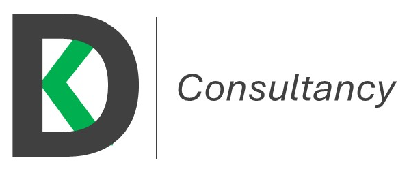
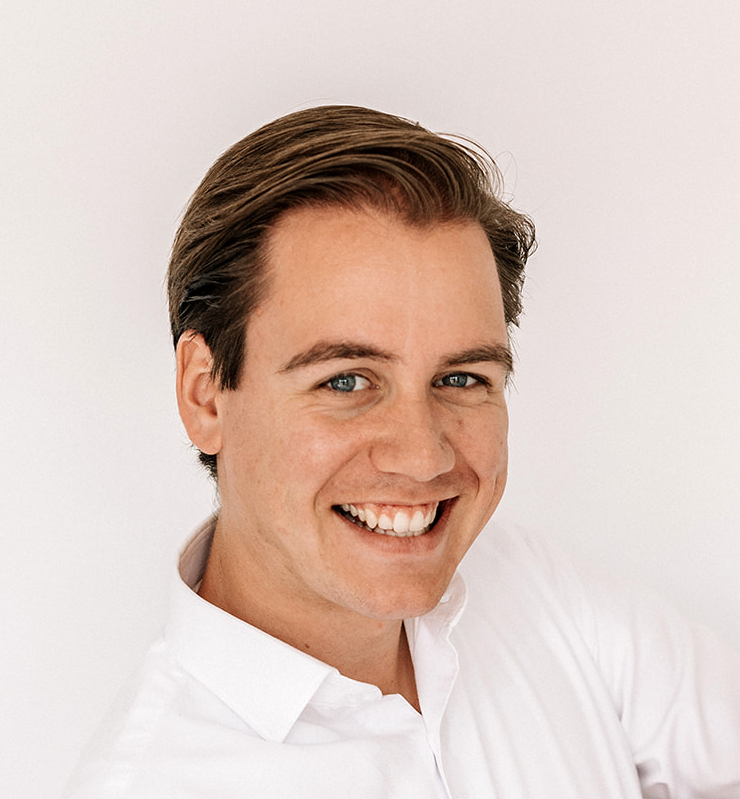

<!DOCTYPE html>
<html lang="en">
<head>
<meta charset="UTF-8">
<meta name="viewport" content="width=device-width, initial-scale=1.0">
<title>Daniel Kalmann Consultancy</title>

</head>

<body>

<header>
    
    <nav>
        <a href="#expertise">Expertise</a>
        <a href="#about">About</a>
        <a href="#contact">Contact</a>
    </nav>
</header>

<section class="hero">
    <h1>Unlocking Procurement Excellence through Digital Transformation</h1>
    

        Independent consultant helping organizations optimize processes, implement digital solutions, 
        and achieve sustainable savings — without turning your team into robots (unless they want to).
    

</section>

<section id="expertise">
    <h2>Expertise – The Excellence Pillars</h2>
    
Focused service offerings designed to transform your procurement operations into a strategic value driver.

    

        

            <h3>Digital Procurement Strategy</h3>
            
Roadmap development, tool selection (SaaS), and GenAI for procurement. Aligning technology with business goals.

            <ul>
                <li>Roadmap Development</li>
                <li>Tool Selection (SaaS)</li>
                <li>GenAI Integration</li>
            </ul>
        

        

            <h3>Procurement Excellence</h3>
            
Strategy-to-execution, taxonomy restructuring, and operating model advisory to elevate your procurement function.

            <ul>
                <li>Operating Model Advisory</li>
                <li>Taxonomy Restructuring</li>
                <li>Strategy Execution</li>
            </ul>
        

        

            <h3>Process Optimization</h3>
            
Source-to-Pay (S2P) implementations, P2P optimization, and automation for maximum efficiency.

            <ul>
                <li>S2P Implementation</li>
                <li>P2P Optimization</li>
                <li>Automation & Efficiency</li>
            </ul>
        

    

</section>

<section id="about">
    <h2>About Me</h2>

    

        

        

            <h3>Daniël Kalmann</h3>
            

                With over 10 years of experience in Procurement Excellence and Digital Transformation, 
                I have built a career on bridging the gap between complex business processes and high-end digital solutions.
            

            

                My approach is strategic, results-oriented, but always focused on the people who use the tools. 
                Because let’s be honest: even the best system fails if nobody actually wants to use it.
            

            

                I believe that digital transformation is 20% technology and 80% change management.
            

            <h4>Beyond the Boardroom</h4>
            <ul>
                <li>Avid Cyclist</li>
                <li>Boxing Enthusiast</li>
                <li>Proud Dad</li>
                <li>Based in Haarlem, NL</li>
            </ul>
        

    

</section>

<section id="contact">
    <h2>Daniël Kalmann Consultancy</h2>
    

        Transforming procurement into a strategic powerhouse through digital innovation and process excellence.  
        Let’s discuss how I can help your organization.
    

    
<strong>Email:</strong> Kalmann.Daniel@gmail.com

    
<strong>Phone:</strong> +31 (0) 6 8268 7009

    
<strong>Location:</strong> Haarlem, The Netherlands

</section>

    
© 2026 Daniel Kalmann Consultancy — Built with clarity, strategy, and just enough caffeine.

</body>
</html>
